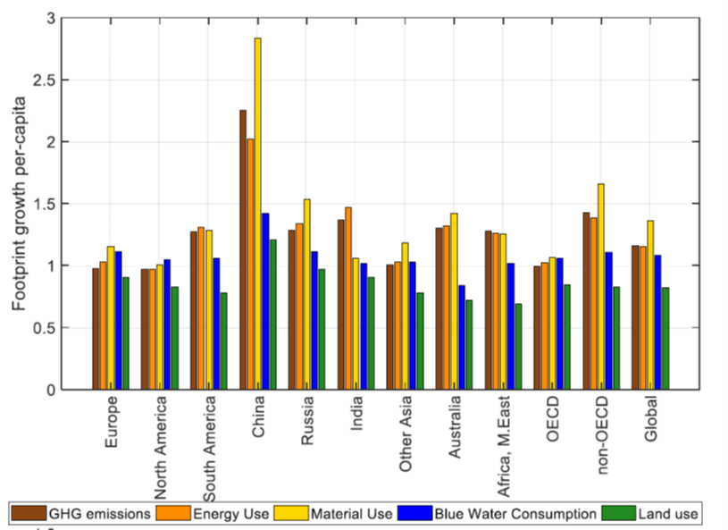
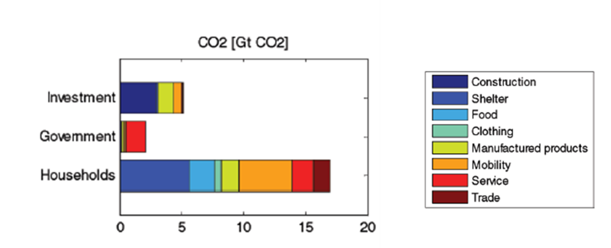

# MRIO seminal works

## Objectives
- Learn how to replicate the methods and results from a few studies. 
- Understand and explain main results from EEIOA studies using MRIO seminal works
- Perform an MRIO analysis in Python
- Interpret the results using the MRIO seminal

### Part 1: Understanding and explaining MRIO results
Wood et al. (2018)  explore the way in which international trade contributes to 4 environmental pressures from the consumption of a population. Among their results, they show the growth in consumption-based footprints per capita between 1995 and 2011 for 11 world regions:

||
|:--:|
|Figure 1. Growth in consumption-based footprints per capita between 1995 and 2011 for 11 world regions (1995 = 1) retrieved from Wood et al. (2018). GHG = greenhouse gas; OECD = Organization for Economic Cooperation and Development|

1.	Does figure 1 present any aspects related to MRIO seminal (e.g., logic, value visualization, language, etc.)? Provide two examples. 

2.	Which environmental footprints increase or decrease in Europe between 1995 and 2011?

3.	Describe step-by-step how would you develop figure, bringing the possible equations required. Note: To facilitate the process, you can focus on one environmental pressure in one region, for one specific year (e.g., GHG emissions footprint in Europe for 2011). 

### Part 2: Python exercises
Hertwich and Peters (2009) developed an analysis of the carbon footprint of multiple countries in 2001. Their results show the carbon footprint of different final demand categories per product.

In this exercise you will reproduce these results using EXIOBASE and compare any changes between 2001 and 2011

||
|:--:|
|Figure 2. Global CO2 footprint for different consumption categories and users retrieved from Hertwich and Peters (2009)|

### Settings
1.	Import EXIOBASE in Python. You can use data import code from Week 10
Final demand contribution per product category to CO2 footprint

2.	Calculate Leontief inverse matrix (L), and total output vector (x)

3.	From satellite matrix (F), select row for CO2 (i.e., F_co2). This can be done using pd.loc, for example
co2_lab = 'CO2 - combustion - air'
F_co2 = F.loc[co2_lab, :]  # select CO2 vector

4.	Calculate the co2 intensity vector (f_co2). Note: This vector might contain nan, and inf elements. Make sure to replace these elements for zeros, for example:
f_co2 = F_co2/x.transpose() # co2 intensity vector
f_co2 = f_co2.replace([np.inf, -np.inf], np.nan).replace(np.nan, 0)  # replacing inf, -inf, and nan with zeros

5.	From the final demand matrix (Y), calculate the global final demand of households (y_hh), government expenditures (y_gov) and gross capital formation (y_cap). This can be done by using pd.xs, for example:
hh_lab = 'Final consumption expenditure by households'
y_hh = Y.xs(hh_lab, axis=1, level=1, drop_level=False)  # selecting hh columns for all countries/regions
y_hh = y_hh.sum(1)  # global final expenditure by household

6.	Calculate the CO2 footprint of each final demand category per product. For example:
co2_hh = f_co2 @ L @ np.diag(y_hh) # CO2 footprint by household expenditures
At this point, it should be 3 vectors (for each final demand category from point 2) of 1 row with 9800 columns (i.e., 49 regions x 200 products)

7.	Reshape each vector using np.reshape. For example: 
co2_hh = np.array(co2_hh).reshape(49,200) # reshape to 49 countries/regions and 200 products
Now, there should be 3 matrices with 49 rows (for each country/region) and 200 columns (for each product)

9.	Sum up across rows. What is the resulted sum?

10.	Combine the vectors and create a new matrix with 3 rows (for each final demand category) and 200 columns (for each product). Note: You can combine them in a new pandas dataframe
We will create 4 main product groups: Agriculture & Mining (ext), Manufacturing (man), Construction (con), and Services (ser). These are groups are different from those in Hertwich and Peters (2009), however, it can be used as proxy to compare the results between 2001 and 2011. Furthermore, we can use the following process to obtain more detailed product categories.

11.	Copy and paste the following code lines that include the indices for the product groups

#### Index product categories

ext_ind = list(range(0,41)) # extraction categories (including agriculture, and mining)
man_ind = list(range(41,149)) # manufacturing (including food, clothing, other products)
con_ind = list(range(149,151)) # construction categories
ser_ind = list(range(151,200))  # services categories

#### Sum per product group

ext = df.iloc[:, ext_ind].sum(1)
man = df.iloc[:, man_ind].sum(1)
con = df.iloc[:, con_ind].sum(1)
ser = df.iloc[:, ser_ind].sum(1)

10.	Re-group the new dataframe and add labels. For example,
#### Re-group dataframe and add labels

df_new = pd.concat([ext, man, con, ser], axis=1)
df_new.index = ['Households', 'Goverment', 'Investment']
df_new.columns = ['Agriculture and Mining', 'Manufacturing', 'Construction', 'Services']

11.	Create a bar graph showing the final contribution per product category to the CO2 footprint. 
Note: Try to customize the graph by including title, labels and legend.
12.	Which sector has a major contribution to the CO2 footprint of each final demand category?
13.	What are the differences between the 2001 and 2011?

## References
Hertwich, E. G., & Peters, G. P. (2009). Carbon footprint of nations: A global, trade-linked analysis. Environmental Science and Technology, 43(16), 6414–6420. https://doi.org/10.1021/es803496a

Wood, R., Stadler, K., Simas, M., Bulavskaya, T., Giljum, S., Lutter, S., & Tukker, A. (2018). Growth in Environmental Footprints and Environmental Impacts Embodied in Trade: Resource Efficiency Indicators from EXIOBASE3. Journal of Industrial Ecology, 22(3), 553–562. https://doi.org/10.1111/jiec.12735

